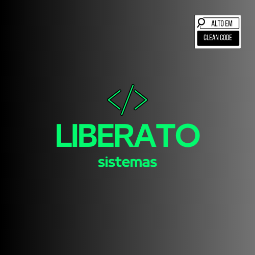

  

  <h3> 
    Vamos nos Conectar 
    
  </h3>
    

 

  

  

  

##  Sobre Mim 

 
Sou Alexandre Liberato, desenvolvedor backend residente em Florianópolis (SC), com formação em Análise e Desenvolvimento de Sistemas e uma sólida trajetória em liderança logística. Estou em transição de carreira, trazendo para a área de tecnologia minha capacidade de organização, resolução de problemas e foco em resultados.
        
Atualmente, trabalho como coordenador de logística na Superpan, mas estou 100% disponível para oportunidades presenciais em Florianópolis. Tenho transporte próprio e total flexibilidade para me adaptar à rotina da equipe.
        
##  Perfil Profissional

Busco minha primeira oportunidade como Desenvolvedor Júnior Backend. Tenho experiência prática com Java, Spring Boot, React.js e PostgreSQL, e estou me especializando em arquitetura de sistemas e microsserviços. Pretendo iniciar o bacharelado em Engenharia de Software em 2026, com o objetivo de atuar em projetos complexos e, futuramente, liderar pequenas equipes de desenvolvimento.

  

  

<h1>  GitHub Status </h1>

  

  <picture>
    <source media="(prefers-color-scheme: dark)" srcset="https://github.com/AlexandreLiberatto/AlexandreLiberatto/blob/output/github-contribution-grid-snake-dark.svg">
    <source media="(prefers-color-scheme: light)" srcset="https://github.com/AlexandreLiberatto/AlexandreLiberatto/blob/output/github-contribution-grid-snake.svg">
    
  </picture>

  

   

  

 

   

  

  
        
##  Habilidades e Tecnologias

  
   
    
    
    
    
    

   
    
    
    
    
    

   
    

  

##  Atualmente Aprendendo

- Java Avançado (Spring Boot)
- Arquitetura backend e padrões de design

  

  

##  Experiência Profissional

Antes de mergulhar no mundo da tecnologia, tive uma carreira robusta na logística, onde desenvolvi minhas habilidades em resolver problemas e gerenciar projetos complexos de forma eficaz. Essa experiência tem se mostrado inestimável na minha abordagem ao desenvolvimento de software, onde busco criar soluções escaláveis e sustentáveis.

  

  

##  Formação Acadêmica

### **Graduação em Análise e Desenvolvimento de Sistemas**
**Instituição:** UNISENAI  
**Conclusão:** Junho de 2025  

- Capacitação para desenvolvimento de sistemas completos, desde a concepção até a implementação, com foco em inovação, eficiência e qualidade.  
- **Áreas de estudo:**
  - Gestão Ágil de Projetos
  - Arquitetura e Modelagem de Sistemas
  - Computação em Nuvem
  - Desenvolvimento Web e Sistemas Web
  - Engenharia de Requisitos
  - Segurança da Informação
  - Sistemas Móveis e Distribuídos
  - Projeto e Gerenciamento de Banco de Dados
  - Interface Humano-Computador  

  

  

##  Cursos em Destaque

### **Análise de Requisitos e Sistemas de Tecnologia**
**Instituição:** SENAI  
**Duração:** 1.200 horas  

- Capacitação para desenvolvimento de sistemas completos, da concepção à implementação, com foco em inovação e eficiência.  
- Desenvolvimento de habilidades práticas e técnicas para atuação em Tecnologia da Informação.

### **Bootcamp da Claro - Java com Spring Boot**
**Instituição:** DIO  
**Duração:** 75 horas  

- Habilidades desenvolvidas para criar aplicações robustas e escaláveis com Java e Spring Boot.  
- **Conteúdos abordados:**
  - Construção de APIs RESTful
  - Persistência de dados com JPA e Hibernate
  - Segurança com Spring Security
  - Testes automatizados
  - Boas práticas de desenvolvimento, como versionamento de código e integração contínua.

### **Formação Java Developer**
**Instituição:** DIO  
**Duração:** 76 horas  

- Habilidades desenvolvidas para criar aplicações robustas e escaláveis com Java e Spring Boot.  
- **Conteúdos abordados:**
  - Fundamentos da linguagem Java
  - Paradigma de Programação Orientada a Objetos (POO)
  - Construção de APIs RESTful com Spring Framework
  - Persistência de dados com JPA e Hibernate
  - Segurança com Spring Security
  - Testes automatizados
  - Boas práticas de desenvolvimento, como versionamento de código e integração contínua

### **Desenvolvimento Web**
**Instituição:** Udemy  
**Duração:** 118 horas  

- Compreensão sólida das principais tecnologias e ferramentas utilizadas na criação de sites e aplicações web.  
- **Tecnologias aprendidas:**
  - **Linguagens:** JavaScript, PHP, HTML, CSS  
  - **Ferramentas:** Bootstrap para layouts responsivos e modernos  
  - **Banco de dados:** MySQL para armazenamento e manipulação de dados  

  

  

##  Contatos

  

  

  Pegue as ondas, sinta ás vibrações positivas!

